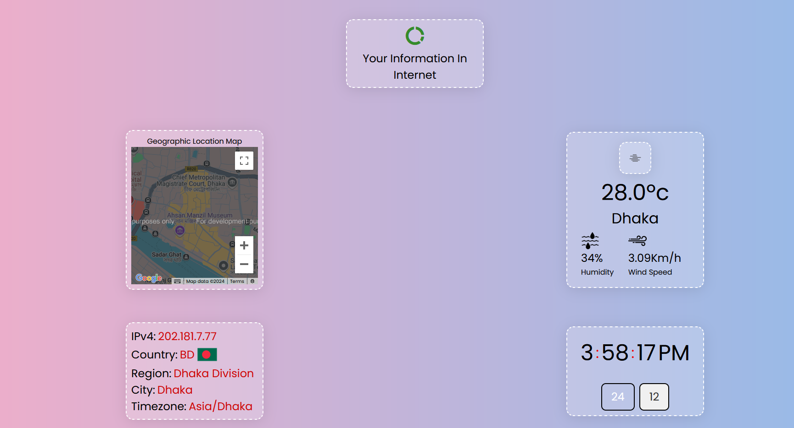

# Your Information Web Application

A web-based application that provides detailed information about your public IP address, geographic location, local time, and weather conditions. It includes an interactive map and a visually appealing user interface.

## Features

- Displays public IP address and geographical details (country, region, city, timezone).
- Interactive map showing the user's location based on IP.
- Live clock with 12-hour and 24-hour formats toggle.
- Current weather information for the detected city.
- Smooth loader animation on page load.

## Demo


*(Include a screenshot of your application here.)*

## Technologies Used

- **HTML**: Structure of the web page.
- **CSS**: Custom styles for the layout, loader, and animations.
- **JavaScript**: Logic for fetching and displaying IP, map, weather, and clock functionalities.
- **APIs**:
  - [IPInfo API](https://ipinfo.io/) for fetching IP-related data.
  - [Google Maps API](https://developers.google.com/maps) for the interactive map.
  - [Weather API](https://openweathermap.org/) for weather data.

## Setup

1. Clone the repository:
   ```bash
   git clone https://github.com/abidsarkar/javascript-mini-learning-project.git
2. Navigate to the project directory:
   cd your-repo
3. Open index.html in your browser.

#API Keys Configuration

    Replace {Your_API_KEY} in the index.html file with your Google Maps API key.
    Replace your_api_key in script.js with your IPInfo API token.
#Project Structure
.
├── index.html         # Main HTML file
├── style.css          # Main CSS file
├── timeStyle.css      # Clock styles
├── weather.css        # Weather styles
├── script.js          # Main JavaScript logic
├── time.js            # Clock logic
├── weather.js         # Weather API integration
├── img/               # Images folder (icons, loader, etc.)
└── README.md          # Project documentation
Screenshots
Loader Animation

Main Page

Future Improvements

    Add user settings to customize themes.
    Implement more weather details like UV index, air quality, etc.
    Enhance responsiveness for tablets.

License

This project is licensed under the MIT License. See the LICENSE file for details.
Contributing

Contributions are welcome! Please fork the repository and create a pull request.